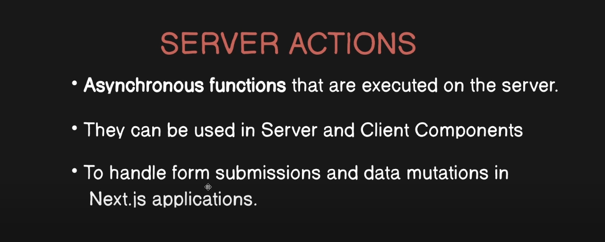
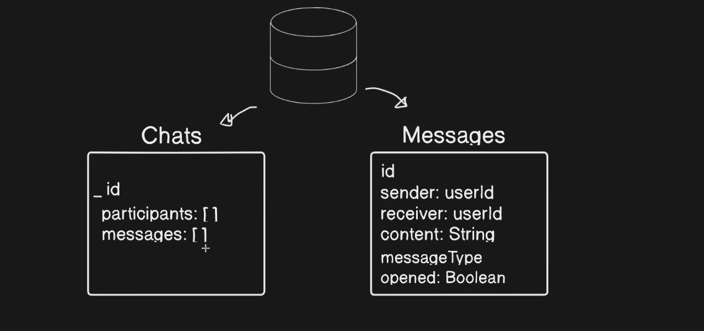

# SnapChat-Web

## TODO:

1. ~~Send image by clicking on camera in a particular chat~~
2. Search funcitonality in sidebar(filter based on names)

## Getting Started

First, run the development server:

```bash
npm run dev
```

Open [http://localhost:3000](http://localhost:3000) with your browser to see the result.

## Thing to learn:

### MONGODB and DB related:

1. Defining schema the typescript way(typesafe way):

```typescript
import { timeStamp } from "console";
import mongoose, { Model } from "mongoose";

export interface IUser {
  username: string;
  fullname: string;
  email: string;
  avatar?: string;
}

export interface IUserDocument extends IUser, Document {
  createdAt: Date;
  updatedAt: Date;
}

const userSchema = new mongoose.Schema<IUserDocument>(
  {
    username: {
      type: String,
      required: true,
      unique: true,
    },
    fullname: {
      type: String,
      required: true,
    },
    email: {
      type: String,
      required: true,
      unique: true,
    },
    avatar: {
      type: String,
      required: true,
    },
  },
  { timestamps: true }
);

const User: Model<IUserDocument> =
  mongoose.models?.User || mongoose.model("User", userSchema);

export default User;
```

2. Caching the connection:

```typescript
import mongoose, { Connection } from "mongoose";

// here we have done this optimisation to check if we already have a cached connection
let cachedConnection: Connection | null = null;

export async function connectToMongoDB() {
  if (cachedConnection) {
    console.log("Using cached MONGODB connection");
    return cachedConnection;
  }
  try {
    const conn = await mongoose.connect(process.env.MONGODB_URI as string);
    cachedConnection = conn.connection;
    console.log("DB CONNECTED");
    return cachedConnection;
  } catch (error) {
    console.log(error);
    throw error;
  }
}
```

## Server Actions:



- **Inline Server Actions:** (can't be used in client components)

  ```typescript
  export default function LoginCard() {
    const authAction = async () => {
      "use server";
      await signIn("github");
    };

    return (
      <>
        <form action={authAction} className="space-y-4">
          <LoginButton />
        </form>
        <div className="mt-4 text-center text-[13px]">
          <span className="font-semibold">New To SnapNext? </span>
          <Link
            className="text-blue-500 hover:underline text-[13px] mr-1 "
            href="/signup"
          >
            Sign Up
          </Link>
        </div>
      </>
    );
  }
  ```

## Error Files:

- The error.tsx file can be used to define a UI boundary for a route segment. It serves as a catch-all for unexpected errors and allows you to display a fallback UI to your users.

- There are a few things you'll notice about the code above:

- "use client" - error.tsx needs to be a Client Component.
- It accepts two props:

  1. error: This object is an instance of JavaScript's native Error object.
  2. reset: This is a function to reset the error boundary.

  When executed, the function will try to re-render the route segment.

  **Example:**

  ```typescript
  "use client";
  export default function Error({
    error,
    reset,
  }: {
    error: Error & { digest?: string };
    reset: () => void;
  }) {
    return (
      <main className="flex  flex-col items-center  justify-center">
        <h2 className="text-center">
          Something went wrong!
          {error.message}
        </h2>
        <button
          className="mt-4 rounded-md bg-sigSurface px-4 py-2 text-sm text-white transition-colors hover:bg-main"
          onClick={
            // Attempt to recover by trying to re-render the auth route segments
            () => reset()
          }
        >
          Try again
        </button>
      </main>
    );
  }
  ```

## Converting string value to boolean:

Here "selectedFile" is a string value which we have converted to a boolean.

```typescript
<Dialog open={!!selectedFile}></Dialog>
```

## DB Setup:



### Mongoose things:

- **exec():**
  **When you use exec() to run a query, you get exactly a promise as response.**
  **exec()** function returns a promise, that you can use it with then() or async/await to execute a query on a model "asynchronous". So the question is "If I can just use user = await UserModel.find() and it works currectly, so why should I use exec() function?".

- **Internal error: Error: Only plain objects, and a few built-ins, can be passed to Client Components from Server Components. Classes or null prototypes are not supported.**
  **Solution:** convert to string before passing to client component

  ```typescript
  return JSON.parse(JSON.stringify(newMessage));
  ```

- ```typescript
  const chat: IChatDocument | null = await Chat.findOne({
    participants: { $all: [authUserId, otherUserId] },
  }).populate({
    path: "messages",
    populate: { path: "sender", model: "User", select: "fullname" },
  });
  ```

  **Exlaination:**

  - ` .populate(...)`: This method is used to automatically replace the specified paths in the document with documents from other collections. It's a way to perform **JOIN-like operations in MongoDB**.
  - `{ path: "messages" }`: This indicates that the messages field, which is likely an array of message references (IDs), should be populated with the actual message documents.
  - `populate: { path: "sender", model: "User", select: "fullname" }`: This further populates the sender field within each message. It indicates that the sender field, which is a reference to a user document, should be populated with data from the User model, but only including the fullname field of the user.

## Sending Image as "blob":

```typescript
const handleSendMessage = async (imgUrl: string) => {
  setIsLoading(true);
  try {
    // fetch the image and convert it to a blob
    const blob = await fetch(imgUrl).then((resolve) => resolve.blob());
    // from the blob the url of the image is generated
    const dataUrl = await readFileAsDataURL(blob);
    // message is sent as an image
    await sendMessageAction(id, dataUrl, "image");
  } catch (error) {
    console.log("Error sending emoji: ", error);
    throw error;
  } finally {
    setIsLoading(false);
  }
};
```

**Explaination:**
Here, fetch(imgUrl) is called to initiate an HTTP request to the provided image URL (imgUrl). The fetch function returns a promise that resolves to a Response object representing the response to the request.
`.then((response) => response.blob()):` This code takes the response and calls the .blob() method on it. The .blob() method extracts the response body as a Blob object, which is a binary representation of the data.
